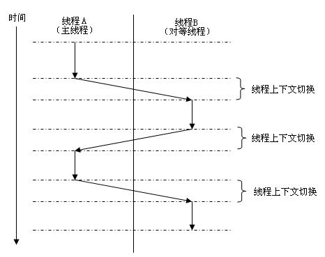

java并发和多线程

在[维基百科](http://en.wikipedia.org/wiki/Java_(programming_language)对Java的描述是：`Java是一种通用的、并发的，基于类的面对对象编辑语言`，**并发**作为Java语言的一项重要特性被特别强调，并发也是Java高级开发人员的必备技能，在大型网站中尤其常用。虽然并发大的概念和基本原理都清楚，但并发的一些基本概念和具体细节并不太好撑握，我之前对这些东西理解的就不深，现在回过头来不得不补课。

## 一些基本概念
计算机最初的时候是没有操作系统的，直接运行二进制程序并且只能是顺序执行，这个时候是不存在并发的概念。等到现代[操作系统](http://en.wikipedia.org/wiki/Operating_system)诞生之后，为了更好地利用计算机资源，并发才正式登上计算机的历史舞台。在维基百科中这样定义[并发](http://en.wikipedia.org/wiki/Concurrent_computing#Concurrent_programming_languages)：

>并发计算是这样一种计算形式，在此形式下程序被设计为一组交互的计算进程集，这组进程集可以被并行地执行。并发程序（进程或线程）能够在一个单一处理器上靠分时方法交替招待每一步，或者把每一个计算进程交给一组处理器中的一个并行地执行，这种处理器可以是物理在一起的或通过网络分布式的。

在CPU单核时代，并发主要靠[操作系统](http://en.wikipedia.org/wiki/Operating_system)分时技术（有的叫[Time-sharing](http://en.wikipedia.org/wiki/Time_sharing)，也有的称为[Time slice](http://en.wikipedia.org/wiki/Preemption_\(computing\)#Time_slice)）来实现，因为CPU内核只有一个，从硬件上来讲CPU同一时间只能处理一个计算机指令，要想实现“并发”必须进行时间片轮询，但这个只是让应用程序**看起来**是在同一时间处理多个。但随着计算机硬件技术的发展，现在很普通的PC都是四核了，服务器甚至有更多的内核或者多颗CPU，这从硬件上保证了可以实现真正的并发-程序可以真正做到并行计算，不需要操作系统分时技术的支持，但真正地实现除了在多核CPU上并行计算外，每个内核还是会使用分时技术来实现的，下面是并发和并行的示例：


分时技术的实现通常有两种，一种是[抢占式（Preemtive）](http://en.wikipedia.org/wiki/Preemption_(computing))，现在主流的操作系统像Windows 7、Linux、Unix、Mac OS X等都是使用的这一种，另外一种是[协作式（Cooperative）](http://en.wikipedia.org/wiki/Computer_multitasking#Cooperative_multitasking.2Ftime-sharing)，在一些早期的操作系统上，比如Windows 3.x，Window 95、97、Me也还保留的有，以及早期的苹果MAC OS上都使用这种方式，它的最大缺点就是假如在执行一个时间片时遇到IO阻塞或死锁，有可能导致其它进程或线程长时间甚至一直获取不了计算资源，因此这种方式已被现在操作系统抛弃。

像C或C++语言，都是通过多[进程](http://en.wikipedia.org/wiki/Process_(computing))的方式来实现并发，Java比这些语言更先进的一点就是使用了更轻量级的多[线程](http://en.wikipedia.org/wiki/Thread_(computing))来实现，理论上来说有更好的并发性能。进程是可运行的计算机程序实例，它拥有独立的地址空间，而线程是共享地址空间。一个进程可以对应多个线程，Java中每个线程拥有共享的堆（Heap）和独立的栈（Stack）空间。进程和线程的区别，可以参考阮一峰写的这篇文章[进程和线程的一个简单解释](http://www.ruanyifeng.com/blog/2013/04/processes_and_threads.html)。

多线程的基本运行方式如下所示：



多线程运行过程中，会发生线程的上下文切换，1秒中可能几千次，Linux下用vmstat命令查看上下切换次数。有时候上下文切换可能比程序代码执行本身还要耗时，因此是否一定要使用多线程，还是要根据实际情况而定，如果是要提升吞吐量并且非常CPU消耗型可能是合适的，但如果是CPU消耗型的程序比如大数据的复杂计算可能就不合适了。

## 线程同步
在Java中使用多线程实现并发时，如果要涉及到对同一可变数据的访问时，就需要进行同步。这里强调的一个前提条件是访问数据是可变的（Mutable），如果数据对象本身不可变（Immutable），我们根本就不需要考虑同步问题，Clojure中所有数据对象都是不可变的，因此用它来编写并发程序会非常简单，并发性能也会好。第二个强调的是同时对一个数据对象进行访问时，如果有读有写或都有写操作，就需要进行同步，否则就可能导致读到脏数据或者写入失败。

下面是一个简单的计数器程序：

```java
package org.bocai.concurrency;

public class UnsafeCounterTest {
	public static void main(String[] args) {
		final UnsafeCounter counter = new UnsafeCounter();

		for (int i = 0; i < 10; i++) {
			Thread thread = new Thread() {
				public void run() {
					for (int j = 0; j < 100; j++)
						counter.inc();
				}
			};
			thread.start();
		}

		try {
			Thread.sleep(10000);
		} catch (InterruptedException e) {
			e.printStackTrace();
		}
		
		System.out.println("The final counter is " + counter.get());
	}
}

class UnsafeCounter {
	private Integer counter = 0;

	public void inc() {
		counter++;
	}

	public Integer get() {
		return counter;
	}

}
```

10个线程每个招待100次，预期结果是1000，但实际运行结果可能小于1000，如下所示：

```
The final counter is 987
```

`inc()`方法里只有一句代码，看起来是原子的，但实际上这个加1的操作并不是原子操作，使用`javap -v`命令可以看到它的字节码其实有多条指令，如下所示：
```
public void inc();
  Code:
   0:	aload_0
   1:	dup
   2:	getfield	#18; //Field counter:Ljava/lang/Integer;
   5:	invokevirtual	#25; //Method java/lang/Integer.intValue:()I
   8:	iconst_1
   9:	iadd
   10:	invokestatic	#12; //Method java/lang/Integer.valueOf:(I)Ljava/lang/Integer;
   13:	putfield	#18; //Field counter:Ljava/lang/Integer;
   16:	return

```

每条字节码指令我们可以把它看作是一个原子操作（严格意义上来说也不一定），当执行加1操作时，首先使用`getfield`指令将当前值推动栈顶，然后再使用`iadd`指令进行加1操作，最后使用`putfield`指令把计算后的值重新设置回去。如果一个线程执行`putfield`指令之前，另外一个线程已执行了`getfield`指令，那么虽然执行了两次加1操作，但实际上只增加了1。

因此我们需要对这行代码做同步处理，Java中最常用的同步操作是使用同步关键词`synchronized`来实现，加上之后代码如下所示：
```java
public synchronized void inc() {
		counter++;
	}
```
再进行测试，结果一定会是预期中的1000。

这种在方法上加同步关键字的方式，如果是实例方式锁默认是加在实例对象上，如果是静态方法锁默认是加在类对象上的，不管是否访问的是同一实例只要调用同一方法都会同步，这在某些地方是没有必要的，比如把上面的例子修改一下，每个线程对自己的实例对象操作，是不需要进行同步操作的：
```java
package org.bocai.concurrency;

import java.util.HashMap;
import java.util.Map;

public class InstanceCounterTest {

	public static void main(String[] args) {
		final Map<String, InstanceCounter> map = new HashMap<String, InstanceCounter>();

		for (int i = 0; i < 10; i++) {
			Thread thread = new Thread("thread-"+i) {
				InstanceCounter counter = new InstanceCounter();
				
				public void run() {

					for (int j = 0; j < 100; j++)
						counter.inc();
					
					map.put(Thread.currentThread().getName(), counter);
				}
			};
			thread.start();
		}

		try {
			Thread.sleep(10000);
		} catch (InterruptedException e) {
			e.printStackTrace();
		}

		for (int i = 0; i < 10; i++)
			System.out.println("counter  " + i + " : " + map.get("thread-"+i).get());
	}
}

class InstanceCounter {
	private Integer counter = 0;

	public void inc() {
		counter++;
	}

	public Integer get() {
		return counter;
	}

}
```

运行结果如下：

```
counter  0 : 100
counter  1 : 100
counter  2 : 100
counter  3 : 100
counter  4 : 100
counter  5 : 100
counter  6 : 100
counter  7 : 100
counter  8 : 100
counter  9 : 100
```

另外一种使用同步关键词的方式是使用同步块，如果加锁对象是this，下面的效果和上面一样，比如：
```java
	public  void inc() {
		synchronized(this){
		counter++;
		}
	}
```
使用同步块的好处是可以缩小同步范围，有时候并不需要对整个方法进行加锁，另外一个区别是可以灵活指定加锁的对象，不一定需要使用实例对象或类对象，可以使用任意的对象。

举个例子来形容线程同步，比如办公室只有一个卫生间，一次只能容纳一个人方便，这个卫生间就是`竞争条件（Race Condition）`。当一个人进去后就在门口牌子上标识为“有人”，这个就相当于是线程的加锁，告诉其它同时间想要上厕所的人，这个资源已被我占位，其他人就需要等待，就相当于是执行线程的wait()方法。只有当前面的人出来后，并把牌子置为“无人”时，其它人才有机会使用。当只有一个蹲位时，一次只能进一个人，翻动一块牌子加一把锁，这个就叫`互斥锁（Mutex）`。如果前面的人是随机通知等待的某一个人，这个就相当于执行线程的notify()方法，如果他是对着所有等待的人喊一嗓子，就相当于是notifyAll()。不管是notify还是notifyAll，多个等待的人都需要竞争资源，如果竞争策略不合理，有可能导致有个倒霉的家伙一直进不去，这有违人性，呵呵。解决的办法一是按时间顺序先到先得，顺序进入，火车站的厕所经常会看到这种情况，总是有机会轮到自己。还有一种情况，就是大老板也在排队，一般情况下大老板时间宝贵，可以优先考虑让他先上，对应到线程里就是线程的优先级，一共有10种，优先级越高被调度到的机会越多。

