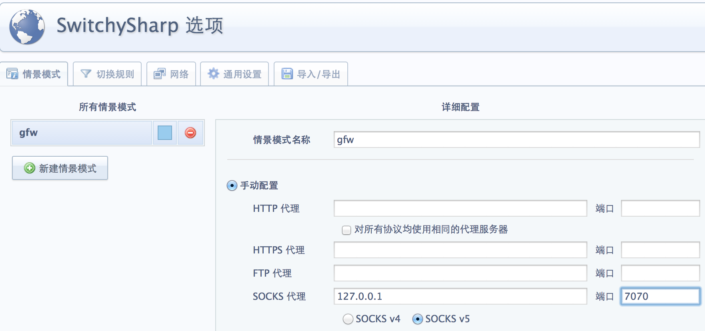
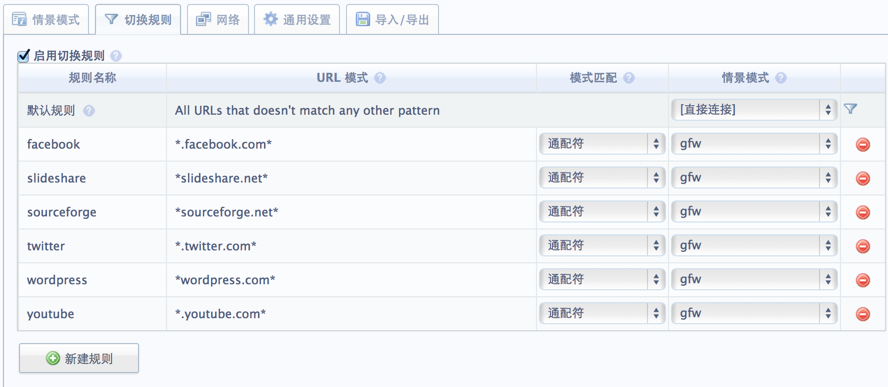
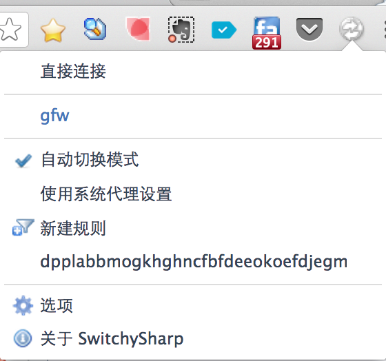

利用VPS进行翻墙

>某些组织为了能够继续愚弄老百姓，花费了巨额国税，修建了一个世界上独一无二的网络长城，屏蔽了很多的网站，你说你把非死不可、推特、油土波等封了也就算了，CNND的一些纯技术网站你们也封，还让不让我们这些码家活呀。每年纳税这么多，就养了这样一群白眼狼，不给你解决问题，专门给你制造麻烦。好在魔高一尺，道高一丈，互联网世界都是给人惊喜，气死你丫的。

在淘宝上买了个VPS，正在搞促销，49元/月挺划算，计划把倒腾一个月写的Blog部署上去。资源有了，不充分利用那是罪过，之前看`道哥的黑板报`里有提到过，可以用SSH Tunnel技术通过VPS很方便地翻墙，于是重新找到了他写的那篇文章，弄了半天之后终于能呼吸到自由世界的空气了，爽！

其实实现非常简单，尤其是Mac/Linux上面，之所以折腾了比较长的时间是因为SwitchySharp代理配置的不对，下面是详细的配置过程。

首先，为了安全起见，可以在VPS上创建一个受限帐号，这个帐号只有执行ssh命令的权限，其它的事一概不能干。

```bash
ln -s /bin/bash /bin/rbash 
adduser -s /bin/rbash -g nobody guest
passed guest
mkdir /home/guest/rbin
ln -s /usr/bin/ssh /home/guest/rbin/ssh
chown -R guest.nobdy /home/guest/rbin
echo "export PATH=/home/guest/rbin" >> /home/guest/.bash_profile
chown -R root.root /home/guest/.bashrc /home/guest/.bash_profile
```

上面的脚本很简单，就不多解释了。

我的终端电脑是Mac，因此只要一条命令即可建立SSH Tunnel包转发:

```
ssh -qCNgf guest@192.154.1.1-D 127.0.0.1:7070
```
`-C`表示使用数据压缩，会比较省流量，后面是VPS创建的帐号和IP地睛
`-D`表示本地侦听端口，在配置代理服务的时候就是填上该参数后面的IP和端口

安装Chrome插件SwitchySharp，新建场景GFW，选择`手动代理->Socket代理`，不要选择Http代理，会报下面的错误：
```
Error 324 (net::ERR_EMPTY_RESPONSE)
```
我就是因为这一步搞错了，弄了半天，心想别人都轻松搞定了，我为啥就不行呢，难道是人品不行？其实这真和人品无关，是我没有搞清楚`HTTP代理`和`SOCKS代理 `的区别，http代理只支持http协议，我们用的ssh tunnel技术，因此肯定不行，需要使用socks代理，其中socks v4只支持tcp，socks v5会支持更多的协议，因此选v5好了，如下图所示：



之后点击`切换规则`的Tab，设置符合哪些规则的时候才使用代理，否则访问国内的网站还得到美国绕一圈累不累呀，毕竟我们的日志环境中还是以访问国内的网站为主，规则也很简单，如下图所示，当符合某个通配符之后就指定它用gfw的场景，不符合自定义规则都走正常的网络访问。



最后选择`自动切换模式`，在需要代理时自动走VPS代理，爽吧。



我测试了一下，访问这些网站速度都可以，YouTube上播放视频也很流畅。不过我在使用不长的时间内也发现，如果你不用代理 ，过一段时间ssh tunnel可能会断开，需要重新手动执行命令进行连接，不过也看到有人实现了自动连接的功能，有兴趣的可以自己去找找。
 
