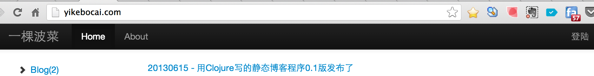
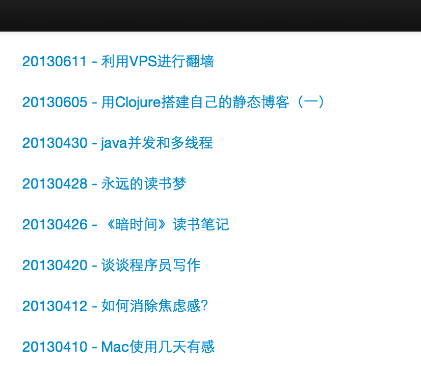

用Clojure搭建自己的静态博客（二）

Tag:Clojure,Blog,Github

>接上篇《用Clojure搭建自己的静态博客（一）》，讲讲具体的搭建过程

## 准备
[Clojure](http://clojure.org)作为一门运行在JVM上的语言，首先需求JDK的支持，请先下载安装[JDK SE](http://www.oracle.com/technetwork/java/javase/downloads/index.html)，推荐1.6+的版本。然后安装Clojure，最新版本是[1.5.1](http://repo1.maven.org/maven2/org/clojure/clojure/1.5.1/clojure-1.5.1.zip)，可以通过如下命令启动`REPL`，比如：

```
java -cp /Users/zxb/app/clojure-1.5.1/clojure-1.5.1.jar clojure.main
```

不过，还是推荐使用[Leiningen](http://leiningen.org/)，Clojure世界的Maven工具，命令比上面要简单的多，在命令行执行`lein repl`即可进入`REPL`环境，后面生成工程、启动应用、打包等都要用到它。安装也非常简单，首先下载一个脚本[lein](https://raw.github.com/technomancy/leiningen/stable/bin/lein)并把它放到你的环境变量里，我直接把它丢到了`/usr/local/bin`下面，然后在命令行下运行`lein self-install`命令，就会自动下载一个`leiningen-2.x.x-standalone.jar`等的jar包到`$USER_HOME/.lein/`目录下，非常方便。我刻最开始使用它1.7版本的时候，还要自己下载和配置。

环境准备完毕后，可以开始真正动手干活了，我们还需要一个真正趁手的编辑器，推荐使用[Sublime Text 2](http://www.sublimetext.com/)或者[Itellij IDEA](http://www.jetbrains.com/idea/)，增加支持Clojure的插件即可，之前有文章有提到，不再赘述。我用的是前者，主要是比较经量级，感觉写个静态博客程序应该不会太复杂，用打日志代替Debug就行了，其实用到后来，我觉得还是用IDEA集成环境比较好，调试起来比较方便，但最后也懒得换了。

## 生成工程
第一篇技术选型时介绍到的Web框架[Luminus](http://www.luminusweb.net/)，可以非常方便地帮我们生成Web工程框架代码，只需要执行一条命令就可以在当前目录生成一个叫myapp的工程目录：

```
lein new luminus myapp 
```

目录结构如下：

```
zmbp:temp zxb$ tree myapp/
myapp/
├── Procfile
├── README.md
├── project.clj
├── resources
│   └── public
│       ├── css
│       │   └── screen.css
│       ├── img
│       ├── js
│       └── md
│           └── docs.md
├── src
│   └── myapp
│       ├── handler.clj
│       ├── repl.clj
│       ├── routes
│       │   └── home.clj
│       ├── util.clj
│       └── views
│           ├── layout.clj
│           └── templates
│               ├── about.html
│               ├── base.html
│               └── home.html
└── test
    └── myapp
        └── test
            └── handler.clj
```
其中`project.clj`是类似Maven的`pom.xml`的文件，唯一区别的是使用Clojure的语法来组织管理，定义了工程名称、版本、描述以及依赖关系，使用到的lein插件等，在运行时也像Maven一样自动到仓库里下载依赖的组件，内容如下：

```
(defproject myapp "0.1.0-SNAPSHOT"
  :description "FIXME: write description"
  :url "http://example.com/FIXME"
  :dependencies [[org.clojure/clojure "1.5.1"]
                 [lib-noir "0.6.2"]
                 [compojure "1.1.5"]
                 [ring-server "0.2.8"]
                 [clabango "0.5"]
                 [com.taoensso/timbre "2.1.2"]
                 [com.postspectacular/rotor "0.1.0"]
                 [com.taoensso/tower "1.7.1"]
                 [markdown-clj "0.9.26"]]
  :plugins [[lein-ring "0.8.5"]]
  :ring {:handler myapp.handler/war-handler
         :init    myapp.handler/init
         :destroy myapp.handler/destroy}
  :profiles
  {:production {:ring {:open-browser? false
                       :stacktraces?  false
                       :auto-reload?  false}}
   :dev {:dependencies [[ring-mock "0.1.5"]
                        [ring/ring-devel "1.1.8"]]}}
  :min-lein-version "2.0.0")
  ```
可以看到一些基础的框架像lib-noir、compojure等都已加进来了，插件用了lein-ring，可以用来启动、打包。

`resource/public`目录下放的是静态的资源文件，像css、js，以及用到的图片文件、h2数据库文件等。

`src`目录下放的是源代码，其中`repl.clj`实现了应用的启动和停止以及资源文件所在目录的定义，就是上面提到的resource目录，基本不会动到这里的代码。`handler.clj`主要实现了对一个HTTP请求生命周期的管理，可以指定初始化信息，路由处理信息，以及自己实现的middleware。`route/home.clj`使用了Compojure里的路由功能把不同URI映射到不同的处理模块上。`util.clj`定义了一些工具函数。html源文件是放在`views/templates`下面，`layout.clj`主要调用模板引擎clabango实现模板的渲染，把动态内容转成静态html页面。

不用修改任何代码，我们在命令行执行`lein ring server`启动应用，默认端口是3000，如果想用其它端口可以在后面追加自定义端口号。启动后浏览器会自动打开默认主页，这在开发环境非常有用，但在服务器环境中因为没有桌面会报错，可以使用如下命令来启动`lein ring server-headless`，也可以修改`project.clj`文件，把`open-browser`设置成`true`。第一次启动时会自动下载依赖的jar包，如下所示：

```
zmbp:myapp zxb$ lein ring server
Retrieving lib-noir/lib-noir/0.6.2/lib-noir-0.6.2.pom from clojars
Retrieving com/taoensso/timbre/2.1.2/timbre-2.1.2.pom from clojars
Retrieving com/taoensso/tower/1.7.1/tower-1.7.1.pom from clojars
Retrieving markdown-clj/markdown-clj/0.9.26/markdown-clj-0.9.26.pom from clojars
Retrieving ring-mock/ring-mock/0.1.5/ring-mock-0.1.5.pom from clojars
Retrieving ring/ring-codec/1.0.0/ring-codec-1.0.0.pom from clojars
Retrieving markdown-clj/markdown-clj/0.9.26/markdown-clj-0.9.26.jar from clojars
Retrieving lib-noir/lib-noir/0.6.2/lib-noir-0.6.2.jar from clojars
Retrieving ring-mock/ring-mock/0.1.5/ring-mock-0.1.5.jar from clojars
Retrieving com/taoensso/tower/1.7.1/tower-1.7.1.jar from clojars
Retrieving com/taoensso/timbre/2.1.2/timbre-2.1.2.jar from clojars
Retrieving ring/ring-codec/1.0.0/ring-codec-1.0.0.jar from clojars
2013-六月-16 20:00:28 +0800 zmbp.local INFO [myapp.handler] - myapp started successfully 
2013-06-16 20:00:28.400:INFO:oejs.Server:jetty-7.6.1.v20120215
2013-06-16 20:00:28.439:INFO:oejs.AbstractConnector:Started SelectChannelConnector@0.0.0.0:3000
Started server on port 3000
```
至此，我们算是完成了学习一门语言时最经典的`Hello,wolrd`功能，前面折腾了这么久，终于看到真正的成品雏形了。Luminus也提供了一个[guestbook](https://github.com/yogthos/guestbook)的演示代码，最好能看一下加深理解。

## 引入Bootstrap

作为目前最火的前端框架，[Bootstrap](http://twitter.github.io/bootstrap/)已被广泛使用，为了让自己的博客看起来更专业更漂亮，首先把它加到工程中。前面已经讲过`resource/public`目录下放置了js、css等静态资源文件，我们只需要把下载到Bootstrap代码拷贝到该目录下相应的css、js、img目录即可。

引入Bootstrap时还费了一番周折，最开始的时候，我是从[Github Bootstrap](https://github.com/twitter/bootstrap)下载的源码，但一直找不到CSS文件，后来查了一下才知道需要编译后才能把[LESS](http://www.lesscss.net/)格式的文件生成CSS代码，它是一种动态的CSS语言，但折腾起来实在费劲，可以直接到这里[下载编译好的Bootstrap](http://twitter.github.io/bootstrap/)。

在代码中使用也很简单，`base.html`是框架页面，直接把Bootstrap的Css和Js引入加到这个页面即可。

```html
 <!-- Le styles -->
    <link href="{{context}}/css/bootstrap.css" rel="stylesheet">
    <style type="text/css">
      body {
        padding-top: 60px;
        padding-bottom: 40px;
      }
    </style>
    <link href="{{context}}/css/bootstrap-responsive.css" rel="stylesheet">

 <!-- Le javascript
    ========================================== -->
    <!-- Placed at the end of the document so the pages load faster -->
    <script src="{{context}}/js/jquery.js"></script>
    <script src="{{context}}/js/bootstrap-transition.js"></script>
    <script src="{{context}}/js/bootstrap-alert.js"></script>
    <script src="{{context}}/js/bootstrap-modal.js"></script>
    <script src="{{context}}/js/bootstrap-dropdown.js"></script>
    <script src="{{context}}/js/bootstrap-scrollspy.js"></script>
    <script src="{{context}}/js/bootstrap-tab.js"></script>
    <script src="{{context}}/js/bootstrap-tooltip.js"></script>
    <script src="{{context}}/js/bootstrap-popover.js"></script>
    <script src="{{context}}/js/bootstrap-button.js"></script>
    <script src="{{context}}/js/bootstrap-collapse.js"></script>
    <script src="{{context}}/js/bootstrap-carousel.js"></script>
    <script src="{{context}}/js/bootstrap-typeahead.js"></script>

```

然后加入一个导航栏，方便不同类别间页面的跳转，以及登陆入口：

```html
<div class="navbar navbar-inverse navbar-fixed-top">
      <div class="navbar-inner">
        <div class="container">
          <button type="button" class="btn btn-navbar" data-toggle="collapse" data-target=".nav-collapse">
            <span class="icon-bar"></span>
            <span class="icon-bar"></span>
            <span class="icon-bar"></span>
          </button>
          <a class="brand">一棵波菜</a>
          <div class="nav-collapse collapse">
            <ul class="nav">
              <li class="active"><a href="/">Home</a></li>
              <li><a href="/about">About</a></li>
              
            </ul>
            <form action="/" method="POST" class="navbar-form pull-right">
             <ul class="nav">
               <li><a href="/login">登陆</a></li> 
             </ul>
            </form>
          </div><!--/.nav-collapse -->
        </div>
      </div>
    </div>
```

效果如下：



## 首页

我想在首页直接把所有的文章按发表的时间倒序列表展示出来，点击文章标题进入到文章详情页面，这就需要动态读取文章列表。先不考虑文章怎么从Github上同步过来，也不考虑文章信息同步到数据库方便后续直接查询数据库展示文章列表而不用每次都解析博客文件，直接读取和解析文件并作排序展示，优先放到后面再做。

实现的方案很简单，扫描博客文件所在目录，把以MD格式的文件全部找出来，然后对文件名进行解析得到发表日期，按倒序排列，最后读取文件的第一行读取博客标题，并把生成的List传到页面上。

首先，在templates下面增加一个`home.html`的页面，用作首页内容的展示，因为`base.html`已经定义好了框架代码，引用进来即可，这个页面只用关注文章列表的展示即可。

```html





<div class="row"> 
	

	<div > <a href="#">{{blog.postdate}} - {{blog.title}}</a> </div>  
	<div ><br></div>
	
	
</div>


```

其中，``中的部分是模板代码，会在页面渲染的时候生成真正的html代码。

为了能在浏览器输入`http://locahost:3000/`时加载这个html页面，需要定义一个路由信息，将URI为`/`的访问，路由到首页的处理模块上，在`routes/home.clj`文件里加入路由定义：

```clojure
(defroutes home-routes
  (GET "/" [] (home-page)))
```
`GET`表示这个HTTP请求是Get请求，`/`表示URI为根目录，`[]`表示url中带的参数，Compojure会自动解析，参数名称和位置必须和url里的一致，为空表示没有参数，`home-page`表示具体处理的函数名称，因此我们需要再一个`home-page`的函数来处理具体的HTTP请求：

```clojure
(defn home-page []
  (layout/render "home.html" 
    {:blogs (blog/load-list-blog "xxx/blog/path")}))
```
`layout/render`是模板引擎进行页面渲染，`home.html`是渲染的html页面，后面大括号中的内容是渲染前传递进入的参数，在html页面可以用`blogs`对象获取具体的数据，这里是从指定的目录加载所有博客文章列表对象。在render时，还可以做些其它有意思的事情，比如把Session里保存过的帐号信息写到Context里，可以实现登录状态的保持，这个后面再具体讲。

具体的加载功能，放在`blog/load-list-blog`里实现，我们在models目录新建一个实现加载blog文章的文件`blog.clj`：

```clojure
;;parse date and title ,20130426-darktime_note.md
;;the first line of the content is title
(defn load-blog-list [path]
	(let [blognames (list-blog-sources path)
		  cnt (count blognames)]
      (loop [bloglist []
      	     i 0]
      	     (if (< i cnt) 
      	     	(recur 
      	     		(conj bloglist 
                  (let [blogname   (nth blognames i)
                        blogpath (str path blogname)]
      							(conj {}
      			  				{:postdate (first(clojure.string/split blogname #"-"))}
                      {:name blogname}
      			  				{:title (read-title blogpath)} 
      			  				)))
      	     		(inc i) )
      	     bloglist))))
```

其中`loop/recur`实现了循环，用以列表的遍历，也可以用`dotimes`、`doseqs`等来实现，`let`的作用是实现变量绑定，有点像Java里的局部变量声明，但不同的是Clojure里变量都是`immutable`的，`conj`实现了Map对象的合并，函数`list-blog-sources`实现了博客文件的读取和过滤以及排序。

```clojure
;;list all blog source files
(defn list-blog-sources [path]
  (let [myfile (file path)]
  	(if-not (.isDirectory myfile ) 
  	"You should pass a directory path"
  	;sort by posting date
  	(sort-by 
  		#(java.lang.Integer/parseInt (first(clojure.string/split % #"-")))
  		> 
  		(filter #(.endsWith % ".md") (.list myfile)))))
)
```

其中，`file`创建了一个`java.io.File`对象，`.isDirectory`用来判断是否是一个目录，将myimg这样的目录排除掉。`sort-by`实现了排序功能，第一个参数是个匿名函数`#()`，用于指定将最后一个序列中的字符串解析成整形，第二个参数是`>`用于条件比较大的放前面，最后一个参数是把所有文件列出来，并通过`filter`来过滤掉非`.md`结尾的文件，`filter`的第一个参数也是个匿名函数。

至此，我们完成了第一个首页的功能，效果如下：



Clojure是不是很简单呢，加上html代码也就不到50行就实现了，这正是Clojure的魅力所在。