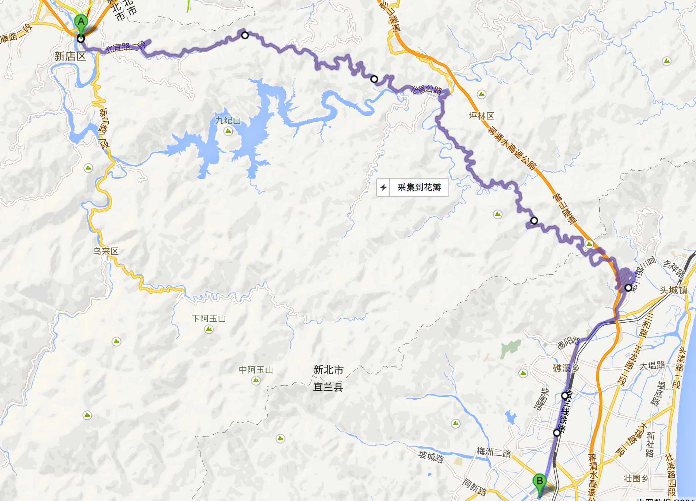
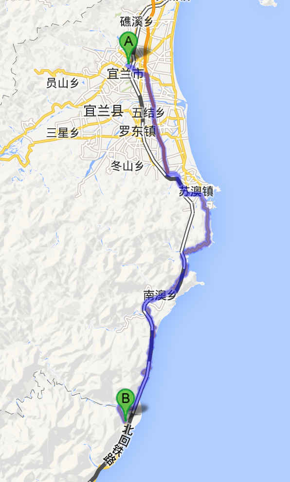
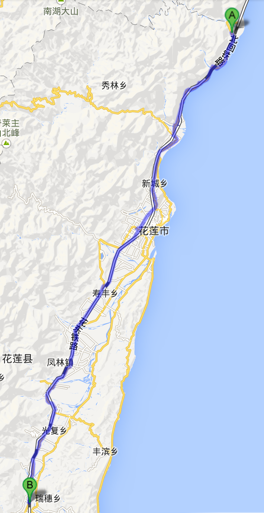
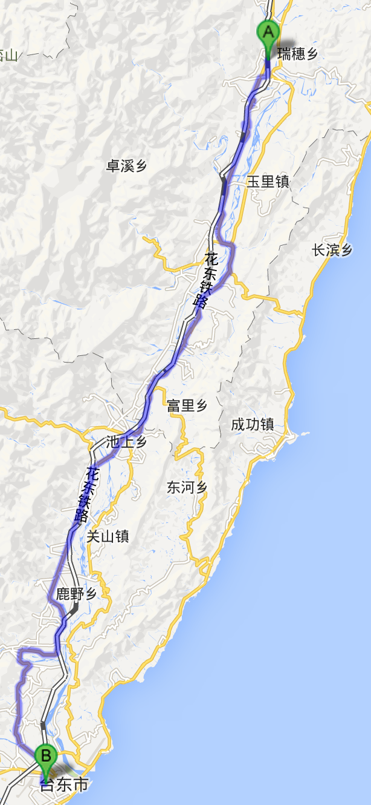
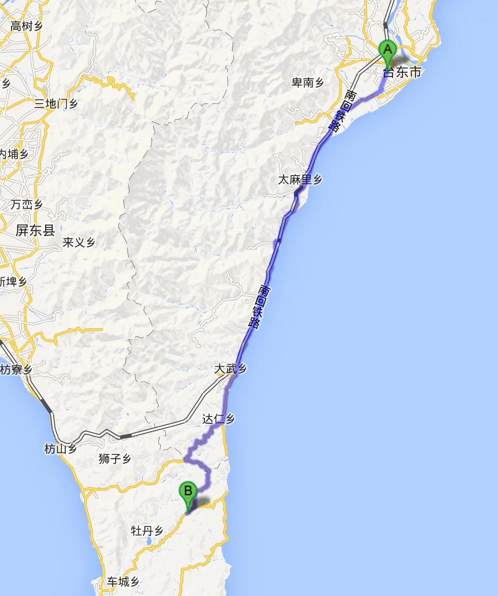
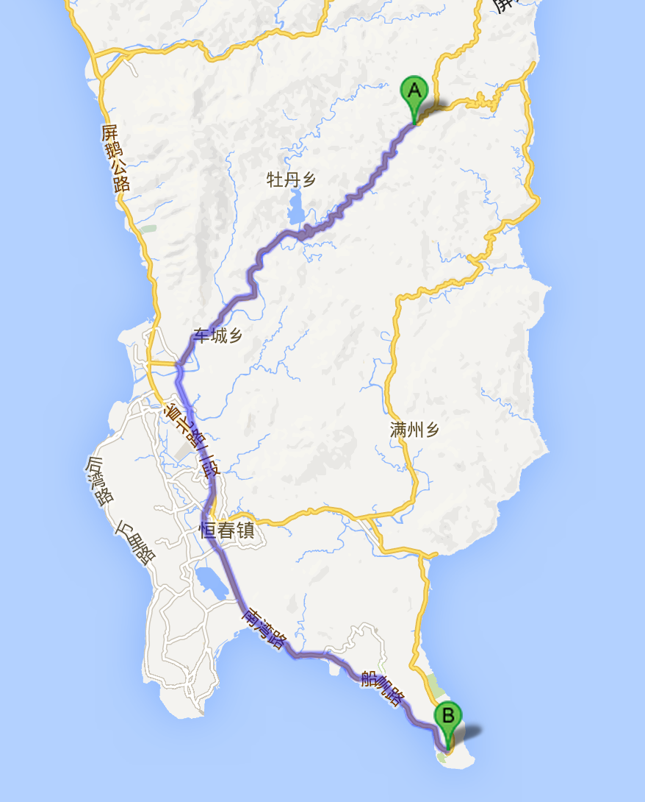
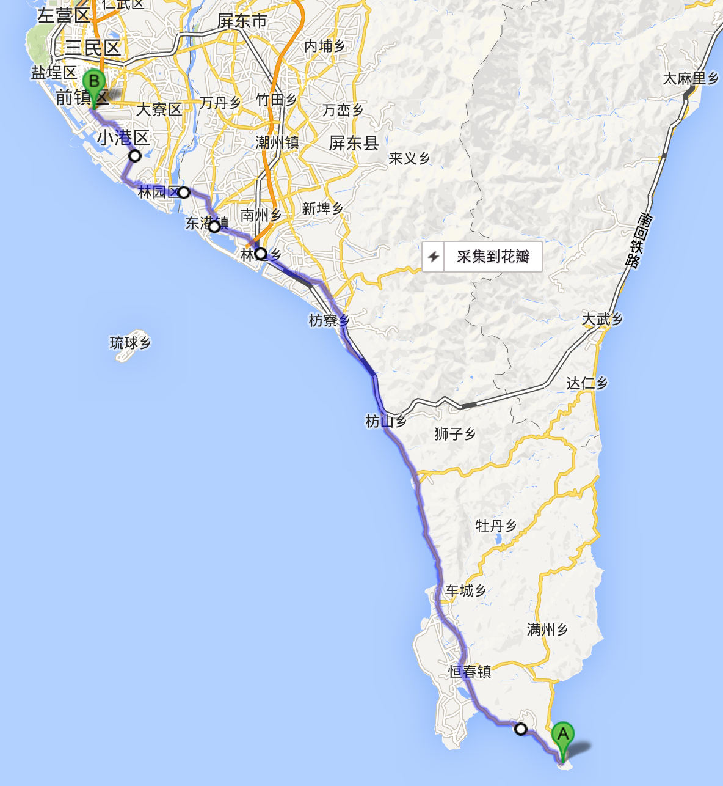

国庆环台湾骑行计划

9.27~10.9
D0(9.27)：杭州~台北
D1(9.28)：台北~宜兰（70公里），新店、小格头、坪林公园、北宜公路、礁溪、宜兰

D2(9.29)：宜兰~和平（78公里），罗东、冬山、苏澳、东澳、南澳、武塔、本汉、和平

D3(9.30)：和平~瑞穗，和平、崇德、新城、吉安、寿丰、凤林、光复、瑞穗（112公里）

D4(10.1)：瑞穗~台东，瑞穗、玉里、富里、池上、关山、鹿野、台东 （110公里）

D5(10.2)：台东~牡丹，台东、三和、太麻里、金仑、大武、南回公路、东源路、牡丹路、牡丹（90公里）

D6(10.3)：牡丹~垦丁，牡丹、中间中、石六路、温泉路、山脚路、恒春、垦丁（50公里）

D7(10.4):垦丁~高雄，垦丁、恒春、枋山、枋寮、东港、林园、高雄（110公里）

D8(10.5)：高雄~嘉义（120公里）
D9(10.6)：嘉义~大甲（120公里）
D10(10.7)：大甲~台北（130公里）
D11(10.8)：台北游玩
D12(10.9)：台北~杭州
