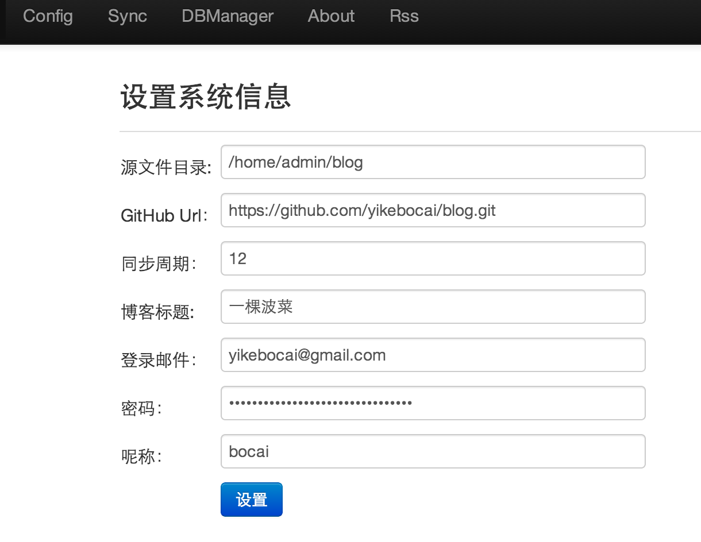
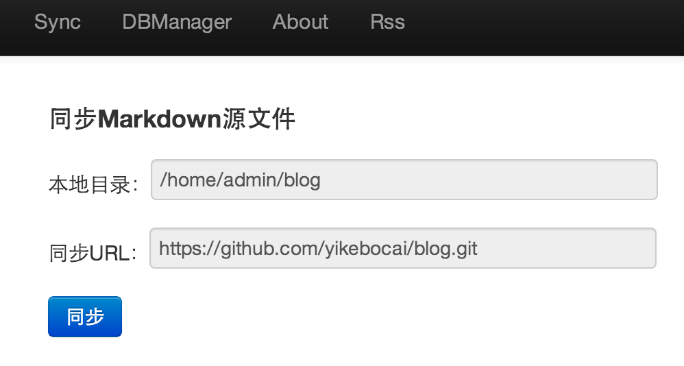
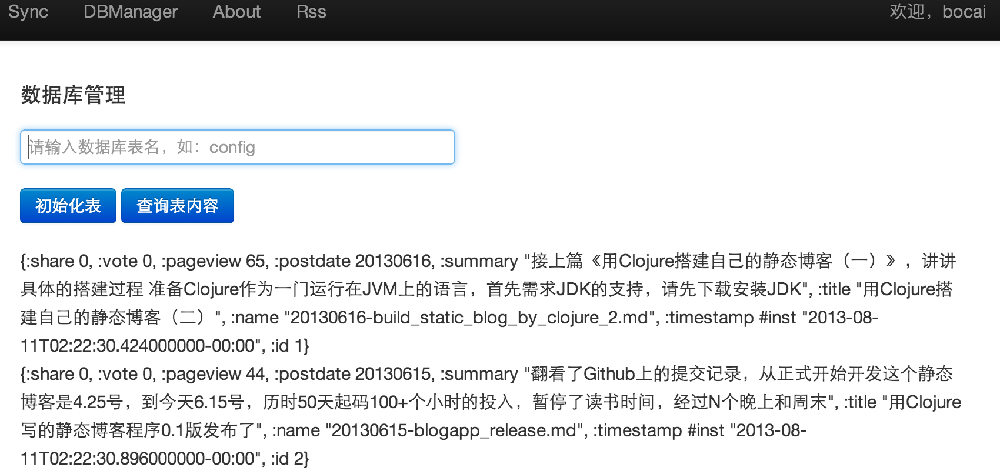

用Clojure搭建自己的静态博客（四）

>写文章有时候很有激情总想写点什么出来，有时候就懒的动手即使有主题在脑中构思了很久，这一段时间的状态就是后者，这个系列后面按计划应该还有至少几篇，比如配置管理，搜索和RSS，页面优化和格式调整，站点搭建等，欠的债慢慢还吧。今天讲讲博客的配置管理部分。

像`wordpress`这种流行的Blog框架，会有非常强大的后台管理功能，包括文章编辑功能、个人风格设置、插件管理、评论管理等等，但我这个号称静态博客，大部分功能由其它站点来提供，比如文章的编辑和保存功能由`github`来代理，评论和分享功能由`友言`和`加网`提供的功能来实现，我不需要考虑复杂的文本编辑器的实现，也不需要了解多个SNS网站的API，更不考虑评论的实现和管理以及垃圾评论问题，因此才可以用这么少的代码来实现一个功能完整的博客系统。但是，还是有一些功能是无论如何都绕不过去的，比如用户名密码的设置、github文章的url、同步的目录、定时同步的设定等，但这些功能相对来说还是非常简单的。

这些配置功能，只有在登录成功后才会展示，后面会讲如何根据登录成功与否展示。

## 系统配置

系统配置主要包括登陆帐号信息、文章同步信息、博客系统的一些配置等，这些信息都放在数据库的`config`表，该表其实是一个KV结构，在key字段上建了个索引，其实就这么一丁点的数据量，有没有索引根本没有区别，只不过是为了更熟悉`korma`的语法而已，表结构如下：

```clojure

(defn create-config-table []
  "create config table,save system info,for example:path,url,email etc,KV structure"
  (jdbc/with-connection
    db-spec
    (jdbc/create-table
      :config 
      [:id "INTEGER PRIMARY KEY AUTO_INCREMENT"]
      [:timestamp :timestamp ]
      [:key "varchar(100)"]
      [:value "varchar"]
      )
    (jdbc/do-commands
      "CREATE INDEX key_index ON config (key)")
    ))
```

这个功能是纯粹的一个数据库访问，看过前面第三部分的介绍想必大家已比较清楚如何实现一个数据表的访问了，这里唯一要注意的一点是密码的保存，为了安全其见不能用明码来保存，像CSND等知名网站竟然用明码来保存用户的密码真是蠢到家了。这里使用了最简单的`MD5`加密方式，虽然前几年已经被山东大学的王小云教授破解，但那耗费的成本是相当高的，密码被破解主要的原因不是因为MD5、RSA这些算法被破解，大多数是因为密码设置过于简单被使用词典破解，或者是被拖库，或者是帐号被钓鱼或木马盗取，关于Web安全方面的知识可以参考[白帽子讲Web安全](http://book.douban.com/subject/10546925/)。配置页面上输入的是明码，在服务端做一个MD5加密然后存入数据，当然有人可能会说了，浏览器通过POST请求明文传到服务器也不安全，咱这个站点就是个人玩玩，估计也人费这劲，不过你想绝对安全或者纯粹满足一下自己的技术爱好，可以使用SSL来加密。因为MD5是不可逆的，因此在修改密码时稍微麻烦一点，因为页面上展示的密码不是原始的明文密码而加密过的，因此在保存时需要一个判断，如果和数据库的值一样说明没有修改过，如果不一样肯定时有修改，再保存到数据库。代码如下：

```clojure
(defn set-config [path url period blogname email password nickname]
  (let [encryptpwd (util/md5 password)]
    (do
      (timbre/debug "set config")
      (set-one-config "path" path)
      (set-one-config "url" url)
      (set-one-config "period" period)
      (set-one-config "blogname" blogname)
      (set-one-config "email" email)
      (if-not (= password (get-value "password")) (set-one-config "password" encryptpwd))
      (set-one-config "nickname" nickname)
      (str "OK")
      )))
```
这里使用到了`do`这个Special Form，它的意思是顺序执行下面的所有表达式，并返回最后一个表达式的值，在调试打印日志时我经常会用到它。`if-not`是和`if`对应的，意思是什么你知道的，不用我说了。

MD5算法直接调用jdk里的`MessageDigest`类，不仅可以实现MD5，还可以实现其它加密算法，实现如下：

```clojure
(defn encrypt [algorithm orig]
  (let [inst (java.security.MessageDigest/getInstance algorithm)
        size (* 2 (.getDigestLength inst))
        raw (.digest inst (.getBytes orig))
        sig (.toString (java.math.BigInteger. 1 raw) 16)
        padding (apply str (repeat (- size (count sig)) "0"))
        ]
    (str padding sig)))

(defn md5 [orig]
  (encrypt "MD5" orig))
```

展示页面也是普通的POST页面，不过使用了JQuery来实现提示信息的控制，页面也用到了模板语法，用来根据保存结果来展示成功或失败的提示信息。代码如下：

```html
<div class="row">
    <div><h2>设置系统信息</h2></div>

    <div>
        <form id="configForm" action="/config" method="POST">

            <table>
                <tr>
                    <td>登录邮件：</td>
                    <td><input type="text" class="span4" placeholder="用户帐号，接收消息的Email" name="email"
                               value={{email}}/></td>
                </tr>
                <tr>
                    <td>密码：</td>
                    <td><input type="password" class="span4" placeholder="登录密码" name="password"
                               value={{password}}/></td>
                </tr>
                <tr>
                    <td>源文件目录:</td>
                    <td><input type="text" class="span4" placeholder="GitHub源文件放置的目录，必须是绝对路径" name="path"
                               value={{path}}/></td>
                </tr>
                <tr>
                    <td>GitHub Url：</td>
                    <td><input type="text" class="span4"
                               placeholder="Github Reposity地址，如：https://github.com/yikebocai/blog.git" name="url"
                               value={{url}}/></td>
                </tr>
                <tr>
                    <td>同步周期：</td>
                    <td><input type="text" class="span4" placeholder="整数，单位为小时" name="period" value={{period}}/>
                    </td>
                </tr>


                <tr>
                    <td>博客标题:</td>
                    <td><input type="text" class="span4" placeholder="比如：一棵波菜的BLOG" name="blogname"
                               value={{blogname}}/></td>
                </tr>
                <tr>
                    <td>呢称：</td>
                    <td><input type="text" class="span4" placeholder="比如：bocai" name="nickname"
                               value={{nickname}}/></td>
                </tr>

                <tr>
                    <td></td>
                    <td>
                        <div id="configBtn" class="btn btn-primary">设置</div>
                    </td>
                </tr>
            </table>
        </form>
    </div>

    
    <div id="configAlert" class="alert alert-success">
        <a class="close" data-dismiss="alert">x</a>
        设置完毕！
    </div>
    
</div>


<!-- click button event  -->
<script type="text/javascript">
    jQuery(document).ready(function(){
    $("#configBtn").click(function(){
    //alert('test');
    $("#configAlert").hide();
    $("#configForm").submit();

    });

    });
</script>
```

配置页面的效果如下：



## 文章同步

因为这是一个静态博客系统，因此所有文章是存在GitHub上面的，需要手动或自动把它同步过来。同步的过程包括使用`git`同步库，解析文章生成摘要信息保存到数据库，然后就可以在首页展示到最新的文章列表。

文章的同步主要利用`git`命令来实现，clojure本身对Java中的shell实现做了一层包装，提供了`sh`函数来执行命令，和直接在命令行相对唯一的区别就是命令和参数必须分开传入，可以查看sh的源代码，是个可变参数：

```clojure
(defn sh
{:added "1.2"}
  [& args]
  ( … )
```

如果是第一次同步，直接用`git clone url`即自动在本地创建一个目录并把内容拉下来，但如果之后想要实现像`svn up`这样的功能就稍微复杂一点了，因为在博客系统里执行`sh`命令时，无法先切换到git目录，然后再用`git fetch`来实现代码的更新，不像shell脚本，java里是没法实现当前目录的切换，必须显示的指定git目录来拉取，然后再进行合并。

```
>git --git-dir /home/admin/blogapp/.git fetch
>git  --git-dir /home/admin/blogapp/.git --work-tree=/home/admin/blogapp merge origial/master
```

源文件下到本地后，还需要做的一件事情是把文章中使用到的图片复制到应用程序目录的`public/resource`目录下，因为我们文章中引用的是相对路径的图片URL，展示正文时web页面实际使用的是域名+这个相对路径，而静态资源文件系统会从resource目录去查找。源代码如下：

```clojure
(defn- sync-github [path url]
  ;if path is exist
  (let [mypath (java.io.File. path)
        gitdir (str "--git-dir=" path "/.git")
        worktree (str "--work-tree=" path)]
    (do
      (if (and (.exists mypath) (.isDirectory mypath))
        (let [gitresp1 (sh "git" gitdir "fetch")
              gitresp2 (sh "git" gitdir worktree "merge" "origin/master")]
          (do
            (timbre/debug "gitresp1:" gitresp1)
            (timbre/debug "gitresp2:" gitresp2)
            (let [error1 (:err gitresp1)
                  error2 (:err gitresp2)]
              (if-not (and (empty? error1) (empty? error2))
                (timbre/error "git pull error:" error1 error2)))))
        (let [gitresp (sh "git" "clone" url path)]
          (do
            (timbre/debug "gitresp:" gitresp)
            (let [error (:err gitresp)]
              (if-not (empty? error)
                (timbre/error "git clone error:" error))))))

      (let [src (str path "/src/myimg")
            dst (str (io/resource-path) "/")
            cpresp (sh "cp" "-rf" src dst)
            error (:err cpresp)]
        (do
          (timbre/debug "myimg path:" dst)
          (if (empty? error) true false)))))
  )
```

上面的功能只是把文章拉到服务器的本地目录，后面还需要解析文件，把摘要信息写到数据库，因为不可能每次展示的时候再实时地解析所有文章，如果文章特别多的时候就会很慢，也不便于查询。保存的信息主要是发布日期（用于排序）、文章标题、摘要、文件名称等。同时，也会解析Tag标签，更新tag表。

```
(defn- sync-db [path]
  (let [timestamp (java.util.Date.)
        dbresp
        (let [bloglist (blog/load-blog-list (str path "/src/"))
              len (count bloglist)]
          (do
            (dotimes [x len]
              (do
                (let [blog (nth bloglist x)
                      postdate (:postdate blog)
                      name (:name blog)
                      title (:title blog)
                      summary (:summary blog)
                      tags (:tags blog)
                      rs (db/find-blog-by-name name)]
                  (if (= (count rs) 1)
                    (let [id (:id (first rs))
                          resp (db/update-blog id postdate name title summary)]
                      (do
                        (timbre/debug "update-blog:" name)
                        (timbre/debug "tags:" tags)
                        (db/update-tags tags id)))
                    (let [resp (db/post-blog postdate name title summary)
                          id (first (vals resp))]
                      (do
                        (timbre/debug "post-blog:" id)
                        (db/update-tags tags id)))

                    ))))
            (db/delete-old-blogs timestamp))
          (db/delete-old-tags timestamp))]
    (if (empty? dbresp) true false)))
 ```
 
 上述的语法都是之前介绍过的，唯一注意的一点是`defn-`，和`defn`唯一不同的是后面多了一橫，这个表示这个函数是私有的，没有的话就表示是公有的。最后的页面Demo演示：
 
 
 
 ## 数据库管理工具
 
 如果你开始的时候建了两张表，后面想再加一张表，你会发现有点麻烦，系统重启重启时会检查h2数据文件是否存在，不存在时才会初始化表，否则是不会初始化的，必须把h2数据文件删除，然后再重新初始化，这会有点不便，因为之前表中的数据会丢失。因此，增加了一个小功能，可以输入表名进行初始化。另外，h2没有客户端可以查询表里的内容有时想看一下原始内容非常不便，因此也增加了一个查表功能，输入表名直接把原始内容以Json格式全部展示。
 
 ```clojure
 (defn init-table [tablename]
  (case tablename
    "blog" (schema/create-blog-table)
    "config" (schema/create-config-table)
    "tag" (schema/create-tag-table)
    (str "No the " tablename)))

;;show table content
(defn show-table [tablename]
  (select tablename))
 ```
 
 页面效果如下：
 
 
 
 ## 后记
 
 上述功能可以查看[源代码](https://github.com/yikebocai/blogapp/tree/master/myapp)中的config.clj、sync.clj、dbamanger.clj以及对应的页面config.html、sync.html、dbmanager.html，当然还是handler.clj。也可以访问我用该系统搭建的[一棵波菜](http://yikebocai.com)。
 

