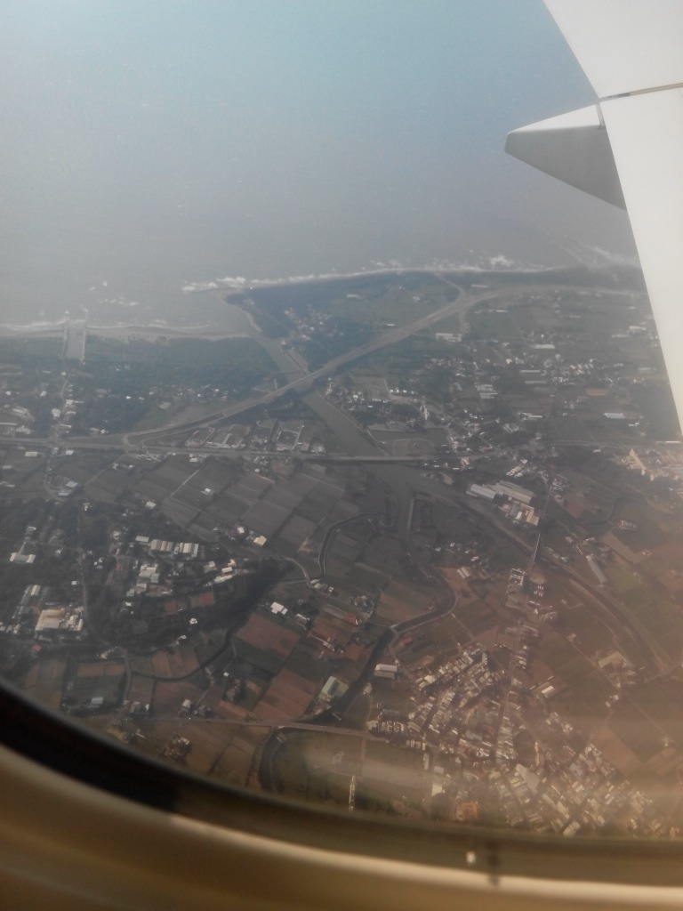

台湾环岛骑行游记

tag:骑行

>历经九天千辛万苦终于完成了台湾环岛骑行，完成了今年人生的第一个梦想，收获很多，但从台湾回来十天了，一直懒得动手写一点环岛游记，倒是香港苹果日报供职的记者队友问我这次的感受，写了一点零星的感想。台湾一行回来后，我的人生也即将面临重大变化，不知道是因为环岛影响了我还是纯属巧合，但我知道追求梦想不应该犹犹豫豫，就像这次环岛成行之前，有各种担心也曾想要不要放弃，其实真的去做了，困难并不你想像的那么大，你远比自己想像的更强大。Just do it!

## 缘起

[台湾](http://zh.wikipedia.org/wiki/%E8%87%BA%E7%81%A3)，是一个既熟悉又陌生的名字，说熟悉是因为从小课本中就有台湾的相关介绍，和大陆仅一海之隔，被称做宝岛台湾是我国第一大岛，像[日月潭](http://zh.wikipedia.org/wiki/%E6%97%A5%E6%9C%88%E6%BD%AD)、[阿里山](http://baike.baidu.com/view/18745.htm)当时都是耳熟能详的台湾代表性景点，它给我的第一印象是美丽。我至今还记得小时候一些零星关于台湾的故事，邻村里有台湾老兵回乡探亲，我们当时过年的压岁钱还停留在几块钱的时候，他出手就是百元大钞，给亲戚邻居买了很多好东西，因此台湾留给我的第二印象就是富饶，当时羡慕的无以复加，心想我要是有个亲戚在台湾就好了。真正近距离接触台湾或者台湾人，是我从郑州来杭州工作之后，当时创建了一个骑行队，经常组织杭州的自行车爱好者夜骑龙井，有一个台湾人也经常来参加，人比较胖骑着大行SP8真担心他把车压垮，和他聊起台湾时说台湾环境很好非常适合骑行自行车运动非常普及，对台湾印象又加深了一层。上大学时我们学校一个全校最受欢迎的政治学教授，还专门做过关于台湾的报告，至今还记得当时学校几千人在大操场上听报告的场景，讲到民进党和台独，讲到他自己去台湾的感受，台湾人民为何不愿回归大陆等，听得我们这些热血青年如痴如醉，我们想当然地认为台湾人民肯定早日盼望回祖国，台独只是一少部分人的想法，原来台湾人民的想法和我们的完全不一样呀，什么事情都不能光听媒体上讲，还是眼见为实。

另外我们这一代，基本上是伴着港台歌曲和影视长大的，像早一点的潘美辰、郑智化，以及后来小虎队、林志颖、张雨生、张惠妹，到近年来的张震岳等都是大受欢迎的台湾歌手，台湾的电视剧尤其是言情剧像`琼瑶系列`也是影响了无数的人，大学快毕业时`流星花园`迅速席卷了整个校园，一时间F4成了最红的大腕，引无数少女竞折腰。台湾的电影看的比较少，印象比较深刻的近几年上映的`赛德莱巴克`和`翻滚吧！阿信`，第一次知道了太鲁阁和宜兰。可以说台湾的流行文化对我们影响还是比较深的，大陆的媒体经常地提到台湾，央视还有一个专门的节目叫`海峡两岸`介绍台湾的情况，不过非常片面地介绍台湾政治，没几个人喜欢看。

前几年[天涯](http://www.tianya.cn)还很火的时候，看过一个台湾人写的[我们台湾这些年](http://bbs.tianya.cn/post-free-1280900-1.shtml)，第一次深入地了解到台湾政治变革、经济变化以及台湾人民的生活状况。去年还读了一个美籍加拿大华人旅居台湾时写的[台湾，你一定要来](http://book.douban.com/subject/7053841/)一书，对台湾的整体情况算是有了一个大概的了解。至此，台湾在我大脑中也有了基本轮廓，借用大陆著名企业家有企业界思想家称号的冯仑先生一句话来说，台湾就是官不聊生、人工幸福、社会和谐。

说陌生，是因为当年国民党撤退台湾后，两岸就势同水火，一边叫着要光复大陆，一边叫着要收复台湾，虽然是同宗同祖但几乎没有交流几十年，改革开放之后来大陆的台湾商人才逐渐多了起来，但这也仅仅限于单向流动和交流，大陆普通老百姓并不能随便去台湾的，除非是探亲或是商务工作，台湾到底是个什么样子并不清楚，很多大陆人可能对台湾的了解还不如万里之外的美国多，直线距离只有短短几百公里却不能直航，还要绕道香港，只到近几年开通直航和开放自由行之后，两岸才真正开始了相互熟悉。我这个梦想的实现，也得益于自由行的开放，自由开放是世界潮流，谁也挡不住历史的车轮。

从确定台湾环岛目标后，就开始做准备了，首先是找同伴，第一个想到的就是将我带到骑行队伍的好朋友 CACA，可惜他比较忙不能同行，又把目标转向了公司，出远门一定要找比较可靠的人，经过一个月的征集终于找到了两个队友，可惜都是菜鸟，一趟径山拉练下来就发现了他们明显的不足，之前根本没有做过训练，体力严重不足，这不仅让我对将来的行程开始担忧起来。幸好，遇到了专门组织台湾环岛骑行的[铁马家庭](http://www.bit.org.tw)，两万五台币的费用免费提供车辆包吃住还有保姆车，我虽然对自己有信心但万一两个家伙扛不住了也有照应，不至于我到时手忙脚乱。邮件沟通几次后就把行程订下来了，因为付款不便连费用都没交，铁马家庭给予了十足的信任，第一印象特别好，这让我对整个行程充满了期待。

## 杭州-香港-台北

从小因为亲戚住的很近也没有其它事情，很少出远门，初中竞赛的时候第一次去县城，之前活动范围不超过周边50里，高中毕业因为看病第一次去了眼中的大都市郑州，大学毕业第一次坐火车第一次跨出河南省第一次见到了真正的大山--泰山，说起来真是惭愧，这人生经历也太逊了点。参加工作后也没多少机会到处走走，作为一个码农只能天天窝在办公室里写代码，北京还是工作了四五年才去的，走出国门更是没有机会，去台湾再次破处，终于有机会走出去看看外面的精彩世界。

我坐的飞机是香港中转的，比直飞便宜不少，不过中间等了几个小时确实难受，好在趁着无聊时光把吴晓波的中国企业史三步曲的最后一本[浩荡两千年](http://book.douban.com/subject/6980818/)给差不多看完了，这真是一套让人拍案叫好的巨作，虽然我并不懂商业。历史从来没有给予商业和商人应用的位置，轻商重农不思进取结果使中国从16世纪后全面落后西方世界，香港的繁荣也得益于重视和尊重商业开展自由贸易，好在大陆慢慢在改变，但政府对商业的破坏力依然巨大，只是现在吃相稍微收敛了一点而已。

在焦急不安的期盼中踏上飞往台北的航班，经过一个多小时的飞行，终于看到了传说中的台湾。当时飞机应该是在桃园县上空，有高空望下去，整齐有序的农田和错落有致城镇村庄，蜿蜒弯曲的公路和川流不息的车辆，台湾给我的第一印象环境不错，没有因为发展经济而对环境造成太大的破坏，这点大陆真应该好好学学。

飞机降落在桃园机场后，第一眼看到的就是巨大的青天白日旗，它默默地偏居一隅半个多世纪，不知道是否还记得当年在大陆时的辉煌，是否还想着有一天能重回老家？历史就是任人打扮的小姑娘，人们看到的永远都是经过掩饰的一面，有机会真应该多出来看看，尤其是有不同声音的地方。

来之前还担心忘了带现金，不知道机场退换台币是否方便，没想到出来看看到一个外币兑换处，有人工也有自动取款机，支付银联卡非常方便，在台湾呆了几天后才知道，银联卡在台湾的支持率已非常高，街头大多数银行都支持直接用银联卡提取台币，但没算过也不太关心手续费是多少，这么方便的服务花点钱是应该的。

