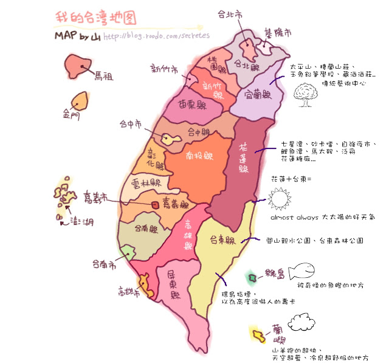
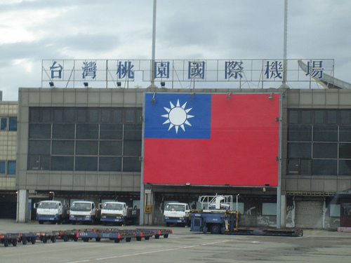
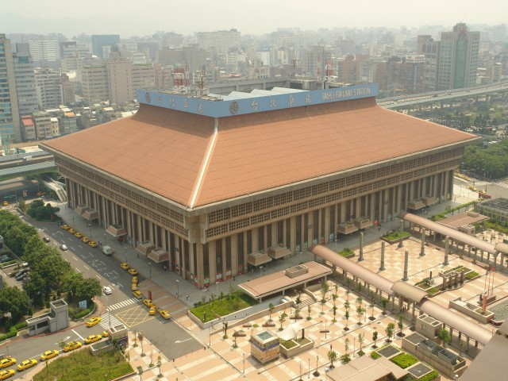
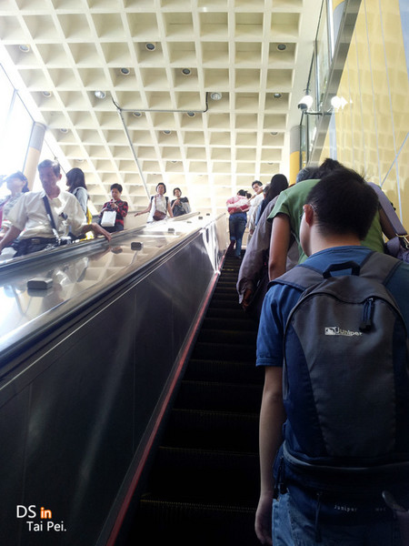
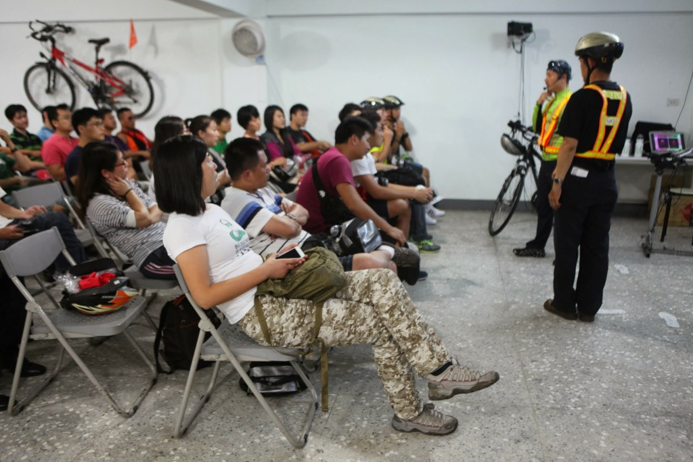
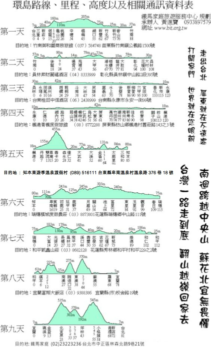

台湾环岛骑行游记

tag:骑行

>历经九天千辛万苦终于完成了台湾环岛骑行，完成了今年人生的第一个梦想，收获很多，但从台湾回来十天了，一直懒得动手写一点环岛游记，倒是香港苹果日报供职的记者队友问我这次的感受，写了一点零星的感想。台湾一行回来后，我的人生也即将面临重大变化，不知道是因为环岛影响了我还是纯属巧合，但我知道追求梦想不应该犹犹豫豫，就像这次环岛成行之前，有各种担心也曾想要不要放弃，其实真的去做了，困难并不你想像的那么大，你远比自己想像的更强大。Just do it!

## 缘起


[台湾](http://zh.wikipedia.org/wiki/%E8%87%BA%E7%81%A3)，是一个既熟悉又陌生的名字，说熟悉是因为从小课本中就有台湾的相关介绍，和大陆仅一海之隔，被称做宝岛台湾是我国第一大岛，像[日月潭](http://zh.wikipedia.org/wiki/%E6%97%A5%E6%9C%88%E6%BD%AD)、[阿里山](http://baike.baidu.com/view/18745.htm)当时都是耳熟能详的台湾代表性景点，它给我的第一印象是美丽。我至今还记得小时候一些零星关于台湾的故事，邻村里有台湾老兵回乡探亲，我们当时过年的压岁钱还停留在几块钱的时候，他出手就是百元大钞，给亲戚邻居买了很多好东西，因此台湾留给我的第二印象就是富饶，当时羡慕的无以复加，心想我要是有个亲戚在台湾就好了。真正近距离接触台湾或者台湾人，是我从郑州来杭州工作之后，当时创建了一个骑行队，经常组织杭州的自行车爱好者夜骑龙井，有一个台湾人也经常来参加，人比较胖骑着大行SP8真担心他把车压垮，和他聊起台湾时说台湾环境很好非常适合骑行自行车运动非常普及，对台湾印象又加深了一层。上大学时我们学校一个全校最受欢迎的政治学教授，还专门做过关于台湾的报告，至今还记得当时学校几千人在大操场上听报告的场景，讲到民进党和台独，讲到他自己去台湾的感受，台湾人民为何不愿回归大陆等，听得我们这些热血青年如痴如醉，我们想当然地认为台湾人民肯定早日盼望回祖国，台独只是一少部分人的想法，原来台湾人民的想法和我们的完全不一样呀，什么事情都不能光听媒体上讲，还是眼见为实。

另外我们这一代，基本上是伴着港台歌曲和影视长大的，像早一点的潘美辰、郑智化，以及后来小虎队、林志颖、张雨生、张惠妹，到近年来的张震岳等都是大受欢迎的台湾歌手，台湾的电视剧尤其是言情剧像`琼瑶系列`也是影响了无数的人，大学快毕业时`流星花园`迅速席卷了整个校园，一时间F4成了最红的大腕，引无数少女竞折腰。台湾的电影看的比较少，印象比较深刻的近几年上映的`赛德莱巴克`和`翻滚吧！阿信`，第一次知道了太鲁阁和宜兰。可以说台湾的流行文化对我们影响还是比较深的，大陆的媒体经常地提到台湾，央视还有一个专门的节目叫`海峡两岸`介绍台湾的情况，不过非常片面地介绍台湾政治，没几个人喜欢看。

前几年[天涯](http://www.tianya.cn)还很火的时候，看过一个台湾人写的[我们台湾这些年](http://bbs.tianya.cn/post-free-1280900-1.shtml)，第一次深入地了解到台湾政治变革、经济变化以及台湾人民的生活状况。去年还读了一个美籍加拿大华人旅居台湾时写的[台湾，你一定要来](http://book.douban.com/subject/7053841/)一书，对台湾的整体情况算是有了一个大概的了解。至此，台湾在我大脑中也有了基本轮廓，借用大陆著名企业家有企业界思想家称号的冯仑先生一句话来说，台湾就是官不聊生、人工幸福、社会和谐。

说陌生，是因为当年国民党撤退台湾后，两岸就势同水火，一边叫着要光复大陆，一边叫着要收复台湾，虽然是同宗同祖但几乎没有交流几十年，改革开放之后来大陆的台湾商人才逐渐多了起来，但这也仅仅限于单向流动和交流，大陆普通老百姓并不能随便去台湾的，除非是探亲或是商务工作，台湾到底是个什么样子并不清楚，很多大陆人可能对台湾的了解还不如万里之外的美国多，直线距离只有短短几百公里却不能直航，还要绕道香港，只到近几年开通直航和开放自由行之后，两岸才真正开始了相互熟悉。我这个梦想的实现，也得益于自由行的开放，自由开放是世界潮流，谁也挡不住历史的车轮。

从确定台湾环岛目标后，就开始做准备了，首先是找同伴，第一个想到的就是将我带到骑行队伍的好朋友 CACA，可惜他比较忙不能同行，又把目标转向了公司，出远门一定要找比较可靠的人，经过一个月的征集终于找到了两个队友，可惜都是菜鸟，一趟径山拉练下来就发现了他们明显的不足，之前根本没有做过训练，体力严重不足，这不仅让我对将来的行程开始担忧起来。幸好，遇到了专门组织台湾环岛骑行的[铁马家庭](http://www.bit.org.tw)，两万五台币的费用免费提供车辆包吃住还有保姆车，我虽然对自己有信心但万一两个家伙扛不住了也有照应，不至于我到时手忙脚乱。邮件沟通几次后就把行程订下来了，因为付款不便连费用都没交，铁马家庭给予了十足的信任，第一印象特别好，这让我对整个行程充满了期待。

## 杭州-香港-台北

从小因为亲戚住的很近也没有其它事情，很少出远门，初中竞赛的时候第一次去县城，之前活动范围不超过周边50里，高中毕业因为看病第一次去了眼中的大都市郑州，大学毕业第一次坐火车第一次跨出河南省第一次见到了真正的大山--泰山，说起来真是惭愧，这人生经历也太逊了点。参加工作后也没多少机会到处走走，作为一个码农只能天天窝在办公室里写代码，北京还是工作了四五年才去的，走出国门更是没有机会，去台湾再次破处，终于有机会走出去看看外面的精彩世界。

我坐的飞机是香港中转的，比直飞便宜不少，不过中间等了几个小时确实难受，好在趁着无聊时光把吴晓波的中国企业史三步曲的最后一本[浩荡两千年](http://book.douban.com/subject/6980818/)给差不多看完了，这真是一套让人拍案叫好的巨作，虽然我并不懂商业。历史从来没有给予商业和商人应用的位置，轻商重农不思进取结果使中国从16世纪后全面落后西方世界，香港的繁荣也得益于重视和尊重商业开展自由贸易，好在大陆慢慢在改变，但政府对商业的破坏力依然巨大，只是现在吃相稍微收敛了一点而已。

在焦急不安的期盼中踏上飞往台北的航班，经过一个多小时的飞行，终于看到了传说中的台湾。当时飞机应该是在桃园县上空，有高空望下去，整齐有序的农田和错落有致城镇村庄，蜿蜒弯曲的公路和川流不息的车辆，台湾给我的第一印象环境不错，没有因为发展经济而对环境造成太大的破坏，这点大陆真应该好好学学。

飞机降落在桃园机场后，第一眼看到的就是巨大的青天白日旗，它默默地偏居一隅半个多世纪，不知道是否还记得当年在大陆时的辉煌，是否还想着有一天能重回老家？历史就是任人打扮的小姑娘，人们看到的永远都是经过掩饰的一面，有机会真应该多出来看看，尤其是有不同声音的地方。



来之前还担心忘了带现金，不知道机场退换台币是否方便，没想到出来看看到一个外币兑换处，有人工也有自动取款机，支付银联卡非常方便，在台湾呆了几天后才知道，银联卡在台湾的支持率已非常高，街头大多数银行都支持直接用银联卡提取台币，但没算过也不太关心手续费是多少，这么方便的服务花点钱是应该的。

想通过WIFI上网联系我的同事，他已提前到达，可是台北机场的WIFI实在不敢恭维，偶尔能连上一下和香港机场相比差多了，因为赶着参加铁马家庭六点钟的说明会，连手机卡都没想到办理，这对于一个天天离不网络的人来说这是在台十几天中最难以忍受的事情，其实只要花500台币就能使用十天不限流量的3G上网服务，还外带一点通话费，价钱公道量又足，下次再来台湾这事千万不能忘了。在机场出口买了国光大巴的车票，可以直达台北车站，很奇怪台北这样的国际大都市，捷运也非常发达，为何不能直接通到机场呢，对于赶飞机的人来说最怕堵车了。

台北车站给我的第一眼印象有点像人民大会堂，雄伟庄严气势不凡，这里算上台北的市中心了，捷运淡水线和板南线交汇处，台铁和高铁也在此汇集，位置有点像上海火车站，因此地下结构也挺复杂，虽然指示牌已够完善了，但我去铁马家庭附近的善导寺站还是转了半天才找到。台北捷运的地铁票和刚刚几天坐过的南京地铁票一样，都是一个塑料圆形币，不知道是不是使用的同一家公司的技术。



在坐地铁时发现了一件有趣的事情，当时正赶上晚上6点钟下班高峰期，车站内人非常多，但我缺发现坐扶梯的人都靠右边站，当时觉得非常奇怪但也没有多想，站随着人流站到了左边空出来的位置上了，但不会儿就有人在后面拍我臂膀示意我让一下，这时我才突然明白，左边原来是留下来的快速通道，赶时间的人可以步行上去，怪不得左边这么空呢，当时就觉得很不好意思，在大陆大家从来没有为别人考虑过。这是台北给我非常深的第一印象，记得台湾著名作家[龙应台](http://zh.wikipedia.org/zh-cn/%E9%BE%8D%E6%87%89%E5%8F%B0)说过这样一段话：

```
    一个国家一个城市是否发达，如果要验证一下，只一场雨足矣。
    若一场倾盆大雨，足足下它三小时，即可一目了然——
    它或许有钱建造高楼大厦，却还没有心力去发展下水道。
    高楼大厦看得见，下水道看不见。
    你要等一场大雨才能看出这国家这城市的真正面目……
```

虽然我没有来的时候并没有赶上大雨无从验证，但就这一点上也能从侧面反映出一个城市是否发达，发达不是仅仅指经济上的富足更是人文上的进步。



## 环岛准备

从台北车站只坐了一站就到了铁马家庭，在一个不太起眼的巷子里，我到的时候已将近7点，环岛前的行程和注意事项介绍已经开始，接待我的是一个中年大妈，大家都叫保妈，而这个活动的创办人也就是她的老公被称为保哥，可见她在团队中的地位之高，之前的邮件就是跟她沟通的。交了钱之后，领取了头盔、衣服、GPS等必需品，一个叫蓝怡的美女很细心地帮我调好头盔，虽然不是骑行菜鸟这些我都能自己搞定，但有美女服务何乐而不为呢：）。

铁马家庭的好几十平方的房间里已基本坐满了人黑压压一片，前面是领队[马志朋教练](https://www.facebook.com/ericma8)正用PPT给大家讲接下来九天的行程和各种注意事项，讲的非常仔细，请不时请[翁教练](https://www.facebook.com/profile.php?id=100000055262741)进行示范，相当专业。印象比较深的就是`安全骑行，共享路权`的提法，骑车不是越靠边越安全，而是要靠外侧白色实线内一公尺左右，后面有车来了不要急急忙忙往边上躲，而是让后面车辆在对向车辆稀少时绕过我们超车。期间还讲了非常多的注意事项，教了大家一首铁马健康操，这成了后面9天里每天必做的一项热身运动。更有趣的是，铁马家庭为这些热身操配上了歌词，后来才发现，每天的行程也被编成了歌曲，不过太长都都没记住，这首每天都唱好几遍的歌词是：

```
单车环宝岛，运动兼旅游
节能又减炭，环保爱地球
善用变速器，轻快不要急
直行保距离，平安回家去
```



这次的行程一共九天，近一千公里，从台北出发逆时针环岛一圈，前四天在台湾西部平原，后五天是起起伏伏的山地了。这样的行程安排其实是比较合理的，本次参加环岛的预计起码有一半人平时并不怎么骑车的，前面几天强度不大相当于适应性训练，不过一天百余公里也不是件非常轻松的事儿。



晚上住在了台北车站旁边的基督教青年旅舍，预定之前以为青年旅舍会很便宜，其实一点也不便宜，三人间3400台币，后来在西门町住的三个晚上才3900多台币。不过位置在许昌街，碰巧是以我老家命名的，也算是缘分。看地图发现台北的很多街道都是以国内的城市命名的，并且以忠孝东路和中山北路为分隔形成了一个十字架，西北块是以西北的城市，东北块以东北的城市命名，西南块以西南的城市命名，东南块以东南的城市命名，河南地处中原，因此像许昌街、信阳街、南阳街都在靠近台北车站的中心地带，这样的命名方式不但有特别的纪念意义，还很方便定位，只要略懂点地理知识就行了。国内上海很多道路也是以城市和省份命名的，据说当时台湾光复后，台北的街道命名就是参考了上海道路的命名方式。

# 画了一个圈

```
那路雖然遙遠漫長，我依然往前衝，只因心中充滿著希望
刮風、下雨、烈日、上坡，我都不畏不懼，更會繼續努力
那路雖然遙遠漫長，我依然往前衝，只因心中充滿著希望
南迴公路、蘇花北宜，我都不畏不懼，更會繼續努力
那路雖然遙遠漫長，我依然往前衝，只因心中充滿著希望
```
每天骑完做放松操的时候要唱的铁马之歌，这个歌词不知道是不是宝哥宝妈他们写的，挺贴合主题，每天的行程也被编成了歌曲，可惜每次做放松操的时候都是应付一下，就想着早点去洗个热水操吃饭休息，歌词是什么压根都没有记住。这次环岛骑游正如这首歌中唱到的那样，刮风、下雨、烈日、上坡，几乎是什么困难都遭遇过了。刚出发前几天每天都顶着个大太阳，最开始没有注意，结果面部、鼻子都晒伤了，不得不像其它人一样，把脸蒙了个严严实实，裸露在外的腿部，9天下来已晒成黑炭。骑到台湾东部时，每天下午最后一段都要遭遇一场阵雨，可能跟台湾的地势有关，东边是太平洋，西边是中央山脉，很容易下雨，最后一天更是赶上了台风，在暴雨中完成了宜兰到台北的行程。前4天在台湾西部，基本都是平原，两个不大的坡龟山坡和好汉坡也就跟爬个龙井差不多，从第5天开始翻越中央山脉进入到台湾东部后，开始没完没了的爬坡，尤其是苏花公路和宜兰到台北那段，都是山路。刮风还好，只有最后一天因为台风，翻越500多的山时，风大的差点把我连人带车吹翻。所有的困苦艰难都让这次旅程都更加有意义。幸福快乐是什么，就是苦尽甘来的感觉。

# 台北两日游
因为多休了两天，得以有机会在台北休整了两天，参观了总统府、自由广场、中正纪念堂，台湾的政治改革已远远走在了大陆的前面，因此才有现在真正的和谐社会，大陆天天口号喊的很响，就是没有见有实际动作，这次台湾之行让我对国民党有了新的认识。后面还参观了台北故宫博物院，据说都是精华中的精华，北京故宫博物院珍藏的都是当初人家挑剩下实在带不走的破烂货，不过对文物完全没有研究，只觉得好东西真多，逛了大半天腿都快断了，也没有逛完，光鼻烟壶就放满了一个屋子。晚上逛了大名鼎鼎的士林夜市，台湾的小吃果然是种类繁多，但可能期望值太高，几乎没有吃到特别觉得好吃的东西，除了一个鸭血汤，有点小失望。

因为回台北之后就住在西门町，得以逛了几次，小吃时尚用品都很多，是时髦年轻人的天地，据说明星也经常光顾，对我们这种宅男来说，和时尚完全绝缘，看也是看个热闹而。中间还去逛了一下诚品书店敦南总店，氛围确实很好，想买两本禁书但怕被海关查于是放弃了，最后在台大附近二书书店买了一本中国通史，果然遇到海关检查。逛完书店去参观了一下台湾大学，建筑风格还保留了二三下年代日本人建设的模样，教学楼都很老旧，硬件设施可以说相当落后，但这不影响它成为一流的大学，培养无数的人才，反观国内大学，楼堂馆所建的一个比一个气派，但就是不好好搞大学最根本的立校之本-教学。

# 台湾小结
这次台湾之旅，主要就是为了实现自己的环岛梦想，旅程很圆满，不过前9天都在闷头赶路，后2天也只是简单一窥台北风貌，没能好好体验台湾的风土人情，略有遗憾，不过也正好给了下次要来的理由^_^。

铁马家庭是一个非常棒的组织，已帮助无数人完成了环岛的梦想，宝哥宝妈马教练等都非常Nice，让大家有种温暖的感觉，也得以认识来自五湖四海的朋友，很荣幸。感谢铁马家庭，有缘再见！

>本来想好好把这次旅程所见所感记录下来，但是虎头蛇尾匆匆收场，只因加入创业公司后实在太忙了，没有那么多时间来写文章。雄关漫道真如铁，如今迈步从头跃。创业路上很辛苦，希望有机会能再来一次这样的旅程。


