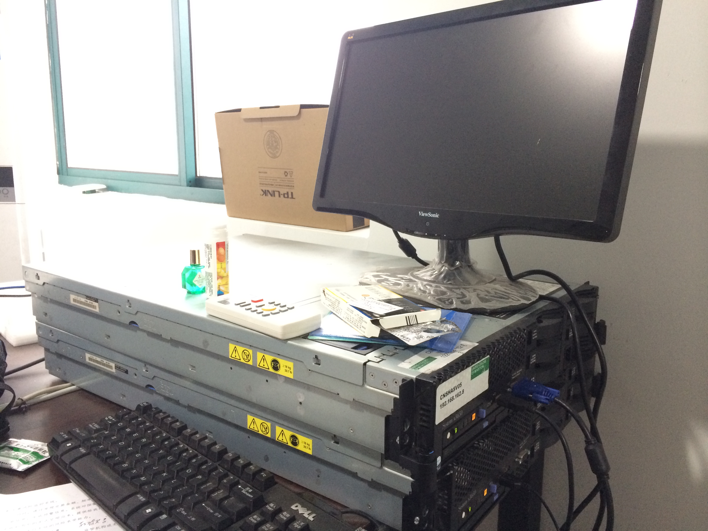

困难总是暂时的



以前在阿里时对硬件资源从来没有操心过，你需要多少机器找运维的同学要就是了，但作为一个初始小公司，各种资源都是短缺的，当然包括硬件资源。最开始拿了一个台式机当开发服务器，基本也能满足日常需要。后来淘来两台二手IBM 3650服务器，顿时感觉从吊丝变身高富帅了，兴奋之极就捋开袖子准备大干一场。

迫不及待地插上电源，巨大的噪声响彻整个办公室，感觉就像跑车的轰鸣声那么入耳，丝毫不觉得吵。经过漫长的等待后，终于启动成功进入了熟悉的Linux界面，发现当初拿机器的时候没有要root密码，这难不倒咱，重新启动到系统菜单的时候按`e`键修改启动菜单项，加入`single`并按`b`键重启，顺利以root帐户登入，然后在命令行输入`passwd`进行密码重置。

接入开始安装JDK、MySQL、Git、Maven等常用程序，一切都很顺利，但到安装Oracle的时候傻眼了，因为之前在台机式上下的是`centos 6.4 64位`的版本，因此Oracle下的也是64位的安装程序，但这台IBM的服务器竟然是32位的CentOS，无法安装。要么重新下载32位的Oracle安装程序，要么把系统重装成64位的CentOS，考虑到64位已成主流并且这个服务器用的是RAID1，6块硬盘只用了一半有点太浪费了，随决定重做RAID安装64位的操作系统。

之前从来没有搞过服务器，RAID都不知道怎么做，查找资料后进入IBM的RAID管理界面，做了RAID5，6块硬盘可以利用5块是最经济安全的选择，没想到做个RAID如此简单，还以为很复杂呢。然后开始安装操作系统，之前用U盘做了一个CentOS 6.4 64位的系统，但插上之去之后完全无法识别，头有点大了。USB安装受挫之后，在万能的淘宝上花15块钱买了两张6.5版本的光盘，等待两天后安装依然识别不了，开始查各种资料，都没有个头绪。没辙了，只能打IBM的服务电话，但一查服务器早已过时，人家不提供售后服务了，这两台机器得有多老可想而知。

之前是各种折腾，先是请教买服务器的小赵，给我分析可能是需要ServerGuide安装盘，我这里没有也没有刻录光驱，人家还好心给我下载了一个还快递了过来，还是不行。后来在网上找各种服务器维修的电话，要么起步一千贵的要死，要么干脆不愿意上门，前后折腾了两个星期也没有搞定，一分钱难倒英雄汉呀。

后来我在想是不是光驱坏了呀，随把另外一台机器拿来试了一下安装盘，很正常地识别出来了，基本确定是光驱的问题，于是从家里拿来了全套工具准备把另外一台机器上的光驱拆过来，安装完毕后再换回去，但随着宜信的项目进入紧张的后期开发以及频繁的出差，这事儿就暂时搁浅了。

一直等到年后忙完宜信的项目空了下来，还开始换光驱。一开始以为服务器也像台式机一样，光驱都是螺丝固定的，把旁边连接的一个小板子拆了下来之后，才发现光驱原来是可以直接可插拔，根本不需要有工具，只需要用手在上面摁下卡牢的小铁片，就能把光驱拆下来了，前后只花了几分钟就换好了，接下来很顺利地把系统安装完毕，一个下午就把两台服务器都弄好了。

困难有时候就是这样子，想尽各种办法都无济于事，长时间解决不了，那种抓肝挠肺的感觉实在太难受了。但你暂时把它放一放，换个思路去解决，也许也就是分分钟的事儿。正所谓：

```
山穷水复疑无路，柳暗花明又一村
```

